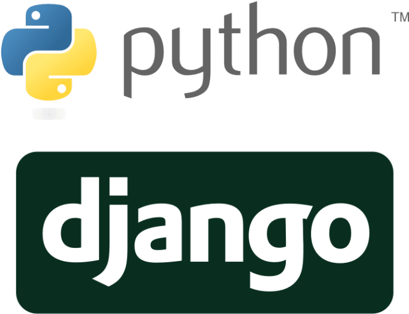

# REST API using Django REST Framework

[](https://www.python.org/downloads/release/python-380/)
[](https://www.djangoproject.com/download/)
[](https://www.django-rest-framework.org/)
[](https://reactjs.org/)
[ ]

This is a project where a REST API server is developed using Django framework and a simple GUI using React JS.

<p align="middle">
    
    
</p>

## Table of Contents

- [Project Overview](#projectoverview)
- [Features](#features)
- [Installation](#installation)
- [Usage](#usage)
- [Contributors](#contributors)
- [License](#license)

## Project Overview

The Django Project is a web application that provides a RESTful API server using the Django framework. It also includes a simple graphical user interface (GUI) built with React JS. The application allows users to interact with the API server through the GUI, making it easier to consume the data.

## Features

The Django Project includes the following features:

- A REST API server built with Django framework
- A simple GUI built with React JS
- User authentication and authorization
- Secure data storage using SQLite database
- Create, Read, Update, and Delete (CRUD) operations on data

## Installation

### Backend

To install the Django Project, follow these steps:

1. Clone the repository to your local machine

```bash
git clone https://github.com/your-username/django-project.git
```

2. Navigate to the project directory:

```bash
cd django-project
```

3. Create a virtual environment and activate it:

```bash
python3 -m venv env
source env/bin/activate
```

4. Install the required packages using the requirements.txt file:

```bash
pip install -r requirements.txt
```

5. Migrate the database:

```bash
python manage.py migrate
```

6. Create a superuser:

```bash
python manage.py createsuperuser
```

7. Run the Django server:

```bash
python manage.py runserver
```

8. Open a web browser and navigate to http://localhost:8000/ to view the GUI.

### Frontend

To install the React Project, follow these steps:

1. Navigate to the frontend directory:

```bash
cd frontend
```

2. Install the required packages using the package.json file:

```bash
npm install
```

3. Run the React server:

```bash
npm start
```

4. Open a web browser and navigate to http://localhost:3000/ to view the GUI.

## Usage

Once the server is running, you can interact with the API server through the GUI. The GUI provides a user-friendly interface to view, create, update, and delete data. You can also use tools such as curl or Postman to interact with the API server directly.

## Contributors

[Daniele Bocchino](https://danielebocchino.github.io/)

[](https://github.com/DanieleBocchino)  
[](https://www.linkedin.com/in/daniele-bocchino-aa602a20b/)

## License

The Django Project is licensed under the MIT License.

[](https://github.com/DanieleBocchino/django-project/)

[](https://github.com/DanieleBocchino/django-project)
[](https://github.com/DanieleBocchino/django-project)
[](https://github.com/DanieleBocchino/django-project)
[](https://github.com/DanieleBocchino/django-project)
[](https://github.com/DanieleBocchino/django-project)
